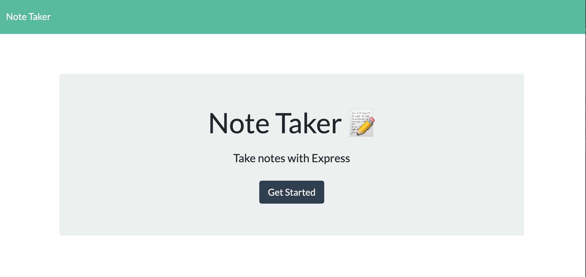
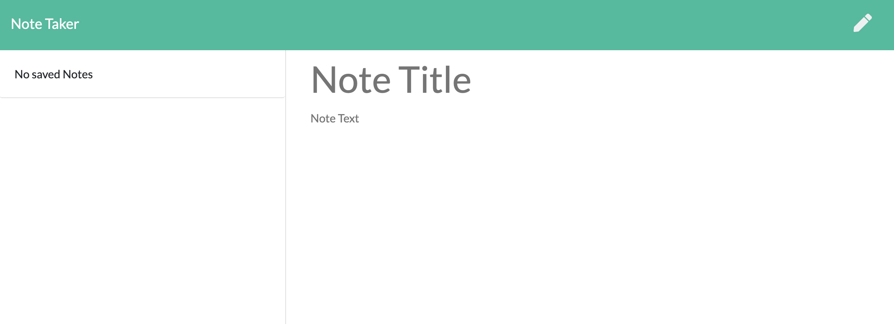
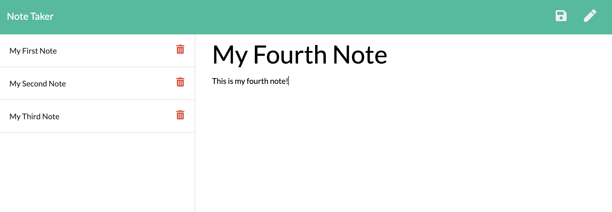
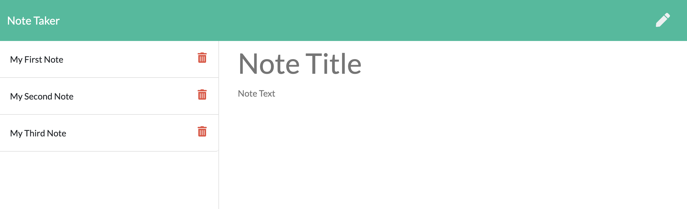

# **Note-Taker**
------

## **Contributors**

@KingKitty89

## **Description**

For this project I was given the frontend code needed to create an easy to use note-taker application. I then built the backend code required and connected the two. The application will allow a user to write, save, and delete notes. The application uses an express backend and saves and retrieves note data from a JSON file. The fs module is used to read and write to this file. 

I created the following HTML routes: 

* GET "/" returns the index.html file.

* GET /notes returns the notes.html file.

I created the following API routes: 

* GET /api/notes reads the db.json file and returns all saved notes.

* POST /api/notes receives a new note, saves it, and adds it to the db.json file.

* DELETE /api/notes/:id receives a query paramter which contains an id of a note to delete from the sidebar when the trash can button is clicked. This in turn also removes the note from the db.json.

  

## **Technology Stack**
* HTML 
* CSS 
* JavaScript
* Node.js
* Bootstrap
* express.js
* JQuery

## **Installation**

npm i

## **Usage**

This application will help users easily keep track of information by allowing them to take persistent notes and be able to call on those notes when needed. 

## **Contact**
* #### **Name:** Jessica Helft (@KingKitty89)
* #### **Email:** [jessicahelft@gmail.com](jessicahelft@gmail.com)
* #### **LinkedIn:** [LinkedIn](https://www.linkedin.com/in/jessicahelft)

## **Tests**

<h3 align ="center"><a href ="https://drive.google.com/file/d/1htQpWXPep6DhwCx8mFfBmdVzPCxewhSO/view">Live Demo</a></h3>

